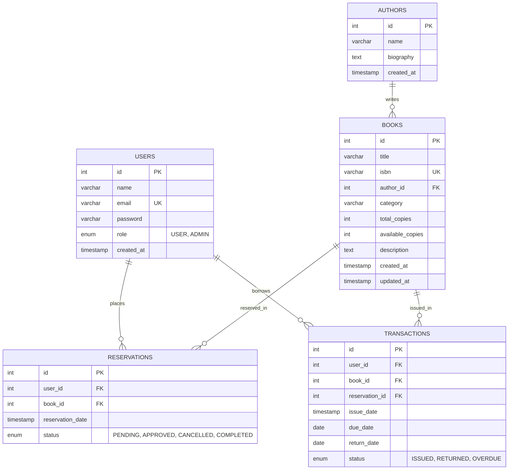

# Online Book Inventory & Reservation System

[](https://nodejs.org/)
[](https://expressjs.com/)
[](https://react.dev/)
[](https://vitejs.dev/)
[](https://www.mysql.com/)
[](LICENSE)
[-brightgreen.svg)](docs/testing.md)

A full-stack departmental library management application engineered with **React (Vite)**, **Node.js/Express**, and **MySQL**. The system supports book cataloging, real-time debounced search, author attribution, transaction-safe concurrency-guarded reservations, circulation (issue/return tracking), overdue calculation, and role-based administrative dashboards.

---

## Table of Contents

1. [Project Overview](#1-project-overview)
2. [Key Features](#2-key-features)
3. [Technology Stack](#3-technology-stack)
4. [System Architecture](#4-system-architecture)
5. [Project Structure](#5-project-structure)
6. [Database Design](#6-database-design)
7. [User Roles](#7-user-roles)
8. [API Documentation](#8-api-documentation)
9. [Environment Configuration](#9-environment-configuration)
10. [Database Setup](#10-database-setup)
11. [Backend Setup](#11-backend-setup)
12. [Frontend Setup](#12-frontend-setup)
13. [Testing](#13-testing)
14. [Git Workflow](#14-git-workflow)
15. [Deployment Readiness](#15-deployment-readiness)
16. [Future Enhancements](#16-future-enhancements)

---

## 1. Project Overview

Academic departments and institutional libraries frequently encounter operational friction due to manual book tracking, inaccurate inventory counts, race conditions during peak reservation requests, and unmonitored overdue loans.

The **Online Book Inventory & Reservation System** delivers a robust digital solution that:
- Maintains strict physical and shelf inventory counts (`total_copies` vs. `available_copies`).
- Enforces ACID-compliant transaction-safe reservation holds preventing race conditions on last-copy titles.
- Automates circulation management, calculating due dates (14-day loan duration) and highlighting overdue books.
- Delivers tailored self-service portals for regular patrons (`USER`) and operational oversight consoles for library administrators (`ADMIN`).

---

## 2. Key Features

The system implements the following verified features:

* **User Registration & Login**: Patron self-registration with email validation and secure credential authentication.
* **JWT Authentication**: Stateless session management with HMAC-SHA256 signed JSON Web Tokens.
* **Role-Based Authorization**: Route guards enforcing granular access for `USER` and `ADMIN` roles.
* **Book Management (CRUD)**: Administrative creation, editing, inventory stock adjustment, and deletion of books.
* **Author Management (CRUD)**: Administrative author registry with biographical profiles and deletion safeguards.
* **Live Book Search**: Real-time debounced keyword search querying title, author name, category, and ISBN.
* **Availability Filtering**: Instant toggling between all titles and titles currently on the shelf (`available_copies > 0`).
* **Concurrency-Safe Reservations**: Database row locking (`SELECT ... FOR UPDATE`) preventing negative stock on simultaneous reservations.
* **Reservation Lifecycle & Approval**: State machine transitions (`PENDING` $\to$ `APPROVED` $\to$ `COMPLETED` or `CANCELLED`).
* **Circulation Desk (Book Issue & Return)**: Issuing books (direct or reservation-linked) and returning books with atomic inventory restoration.
* **Overdue Tracking**: Automated calculation of loan periods and real-time identification of overdue loans.
* **Inventory Management**: Continuous validation ensuring $0 \le \text{available\_copies} \le \text{total\_copies}$.
* **User Dashboard**: Unified patron overview of active reservation holds, loan due dates, and return history.
* **Admin Dashboard**: Real-time operational metrics (catalog counts, available copies, active holds, issued loans, overdue items).
* **Transaction History**: Audit logs of all physical book circulations with timestamps and statuses.
* **Error Handling & Validation**: Centralized error middleware translating technical exceptions into safe, user-friendly responses without exposing SQL or stack traces.

---

## 3. Technology Stack

### Frontend
* **React 18.3**: Declarative component-based user interface library.
* **JavaScript (ES6+)**: Modern asynchronous programming (`async`/`await`, ES modules).
* **Vite 6.0**: Fast build tool and development server with Hot Module Replacement (HMR).
* **React Router DOM 6.28**: Client-side routing with protected route wrappers and dynamic navigation.
* **React Hooks**: State and lifecycle management (`useState`, `useEffect`, `useContext`, `useCallback`, `useMemo`).
* **Vanilla CSS3**: Responsive styling, CSS variables, flexbox, grid, and modal dialogs.

### Backend
* **Node.js v18+**: Asynchronous event-driven JavaScript server runtime.
* **Express.js 4.21**: RESTful web application framework with modular routers and middleware pipeline.

### Database
* **MySQL 8.0**: Relational database management system with ACID transaction support.
* **`mysql2/promise` (v3.12)**: Connection pool management with prepared statements and Promise API.

### Authentication & Security
* **JSON Web Tokens (`jsonwebtoken` v9.0)**: Stateless signed authorization tokens.
* **`bcrypt` (v6.0)**: Cryptographic password hashing with 10 salt rounds.
* **CORS**: Configurable cross-origin resource sharing supporting single or multi-domain origins.

### Version Control & Tooling
* **Git**: Distributed version control system following a structured feature-branch workflow.
* **GitHub Workflow**: Pull request reviews, Conventional Commits standard, and zero-secret commit policies.

---

## 4. System Architecture

The application is structured into a multi-tiered architecture with clean separation of concerns:

```text
┌────────────────────────────────────────────────────────┐
│                   React 18 SPA (Vite)                  │
│  - React Router (Public & Protected Routes)            │
│  - AuthContext (JWT Token & Session State)             │
│  - UI Components (Navbar, BookSearch, Modal, Alert)    │
│  - Pages (Home, Books, Detail, Dashboard, Admin Views) │
└───────────────────────────┬────────────────────────────┘
                            │ HTTP / REST (Bearer JWT)
                            ▼
┌────────────────────────────────────────────────────────┐
│                  Express.js 4 REST API                 │
│  - Middleware: CORS, Request Logger, Auth Guard, RBAC  │
│  - Routes: /api/auth, /api/books, /api/authors,        │
│            /api/reservations, /api/transactions        │
│  - Controllers: Input Sanitization & Response Formats  │
│  - Services: ACID Business Logic & Concurrency Locks   │
│  - Global Error Handling & 404 Interceptor             │
└───────────────────────────┬────────────────────────────┘
                            │ mysql2 Connection Pool
                            ▼
┌────────────────────────────────────────────────────────┐
│                   MySQL 8.0 Database                   │
│  - Tables: users, authors, books, reservations,        │
│            transactions                                │
│  - Row-Level Locking: SELECT ... FOR UPDATE            │
│  - Foreign Keys, Constraints, Cascades, Indexes        │
└────────────────────────────────────────────────────────┘
```

### Backend Layering
1. **Routes Layer (`routes/`)**: Defines HTTP verbs, paths, and middleware chains (`authMiddleware`, `roleMiddleware`).
2. **Controllers Layer (`controllers/`)**: Parses request parameters, query strings, and payloads, invokes services, and returns standardized JSON responses.
3. **Services Layer (`services/`)**: Implements business rules, MySQL transactions (`START TRANSACTION`, `COMMIT`, `ROLLBACK`), inventory updates, and validation logic.
4. **Database Pool (`config/db.js`)**: Manages a connection pool of up to 10 reusable connections with keep-alive enabled.
5. **Database (`MySQL`)**: Executes indexed queries and enforces relational constraints.

---

## 5. Project Structure

```text
FSD_PROJECT/
├── .env.example                     # Root environment variable template
├── .gitignore                       # Production gitignore (dependencies, build, env)
├── LICENSE                          # Standard ISC License
├── package.json                     # Root orchestrator scripts
├── README.md                        # Primary project documentation
├── database/
│   ├── schema.sql                   # MySQL DDL schema with constraints & indexes
│   ├── seed.sql                     # Initial sample data (admin, users, authors, books)
│   └── README.md                    # Database setup instructions & data dictionary
├── docs/
│   ├── README.md                    # Documentation index
│   ├── final-package-guide.md       # Final submission package & setup runbook
│   ├── final-submission-status.md   # Official project submission status report
│   ├── final-presentation.md        # 18-slide academic presentation deck & speaker notes
│   ├── presentation-demo-flow.md    # 18-step live examination demonstration sequence
│   ├── viva-quick-revision.md       # One-page rapid revision sheet (21 full-stack concepts)
│   ├── project-introduction.md      # Verbal presentation scripts (30s, 1min, 2min)
│   ├── final-project-report.md      # Formal 25-section college project report
│   ├── viva-questions.md            # 55 viva questions and model answers (inc. post-demo)
│   ├── demo-script.md               # 10-part, 5-to-10 minute presentation dialogue script
│   ├── demo-checklist.md            # 20-step practical demonstration walkthrough
│   ├── api-quick-reference.md       # Compact REST API directory table
│   ├── screenshot-checklist.md      # 33-point screenshot guide & presentation slide mapping
│   ├── submission-checklist.md      # Comprehensive submission readiness checklist
│   ├── release-checklist.md         # Final release audit & code freeze sign-off
│   ├── project-documentation.md     # 20-section comprehensive technical document
│   ├── deployment.md                # Deployment guide & readiness checklist
│   ├── testing.md                   # Complete test strategy, logs, and QA results
│   └── git-workflow.md              # Branching model, PR process & commit rules
├── backend/
│   ├── .env.example                 # Backend environment variable template
│   ├── package.json                 # Backend dependencies & scripts
│   ├── src/
│   │   ├── app.js                   # Express application setup & middleware stack
│   │   ├── server.js                # Server entry point & connection pool test
│   │   ├── config/
│   │   │   └── db.js                # mysql2 connection pool configuration
│   │   ├── controllers/
│   │   │   ├── auth.controller.js   # Auth request handlers (register, login, me)
│   │   │   ├── author.controller.js # Author CRUD handlers
│   │   │   ├── book.controller.js   # Book catalog & search handlers
│   │   │   ├── health.controller.js # Health probe controller
│   │   │   ├── reservation.controller.js # Reservation lifecycle handlers
│   │   │   └── transaction.controller.js # Circulation & loan handlers
│   │   ├── middleware/
│   │   │   ├── authMiddleware.js    # JWT verification middleware
│   │   │   ├── roleMiddleware.js    # Role-based access control (ADMIN/USER)
│   │   │   ├── loggerMiddleware.js  # Request duration logger
│   │   │   ├── notFoundMiddleware.js# 404 route handler
│   │   │   └── errorMiddleware.js   # Centralized error handler & sanitization
│   │   ├── routes/
│   │   │   ├── index.js             # Central router mounting all sub-routes
│   │   │   ├── auth.routes.js
│   │   │   ├── author.routes.js
│   │   │   ├── book.routes.js
│   │   │   ├── health.routes.js
│   │   │   ├── reservation.routes.js
│   │   │   └── transaction.routes.js
│   │   ├── services/
│   │   │   ├── auth.service.js      # Auth business logic & bcrypt hashing
│   │   │   ├── author.service.js    # Author queries & dependency checks
│   │   │   ├── book.service.js      # Book query builder & search filter
│   │   │   ├── health.service.js    # Database connection test
│   │   │   ├── reservation.service.js # Transaction-safe hold & cancel logic
│   │   │   └── transaction.service.js # Book issue, return, and overdue logic
│   │   └── utils/
│   │       ├── asyncHandler.js      # Promise wrapper catching async errors
│   │       ├── jwt.js               # JWT signing and verification helpers
│   │       └── validators.js        # Input validation & sanitization helpers
│   └── tests/
│       ├── test_auth.js             # Auth unit & integration tests (11 tests)
│       ├── test_authors_books.js    # Catalog & search test suite (15 tests)
│       ├── test_reservations_transactions.js # Concurrency & loan tests (15 tests)
│       ├── test_error_handling_validation.js # Boundary & hardening tests (22 tests)
│       └── test_qa_comprehensive.js # Comprehensive QA regression harness (32 tests)
└── frontend/
    ├── .env.example                 # Frontend environment template
    ├── package.json                 # Frontend dependencies & scripts
    ├── vite.config.js               # Vite build configuration
    ├── index.html                   # HTML5 shell
    ├── src/
    │   ├── main.jsx                 # React root mount
    │   ├── App.jsx                  # Route definitions & layout wrappers
    │   ├── index.css                # Global stylesheet & design tokens
    │   ├── components/
    │   │   ├── Navbar.jsx           # Global header navigation with auth state
    │   │   ├── ProtectedRoute.jsx   # Role-guarded route wrapper
    │   │   ├── BookCard.jsx         # Book display card
    │   │   ├── BookSearch.jsx       # Real-time debounced search bar
    │   │   ├── Alert.jsx            # Dynamic alert banner
    │   │   ├── LoadingSpinner.jsx   # Async loading indicator
    │   │   └── Modal.jsx            # Reusable accessible modal dialog
    │   ├── context/
    │   │   └── AuthContext.jsx      # Authentication & session context
    │   ├── hooks/
    │   │   └── useDebounce.js       # Custom debounce hook for search inputs
    │   ├── pages/
    │   │   ├── Home.jsx             # Welcome page
    │   │   ├── Books.jsx            # Book catalog & live search
    │   │   ├── BookDetail.jsx       # Individual book view & reserve action
    │   │   ├── Authors.jsx          # Author directory & biography view
    │   │   ├── Login.jsx            # Patron/admin login form
    │   │   ├── Register.jsx         # Patron registration form
    │   │   ├── Dashboard.jsx        # Patron reservation & loan dashboard
    │   │   ├── AdminDashboard.jsx   # Administrative overview & stats
    │   │   ├── AdminBooks.jsx       # Admin book catalog management
    │   │   ├── AdminAuthors.jsx     # Admin author directory management
    │   │   ├── AdminReservations.jsx# Admin reservation ledger & cancel
    │   │   ├── AdminTransactions.jsx# Admin circulation desk (issue/return)
    │   │   └── NotFound.jsx         # 404 fallback page
    │   └── services/
    │       ├── api.js               # Fetch client with JWT headers & error translation
    │       ├── authService.js
    │       ├── bookService.js
    │       ├── authorService.js
    │       ├── reservationService.js
    │       ├── transactionService.js
    │       └── adminService.js
    └── tests/
        └── test_frontend_integration.js # 37-step frontend integration test suite
```

---

## 6. Database Design

The database schema (`library_db`) is normalized and enforces data integrity through primary keys, unique constraints, foreign keys, and check constraints:



### Relational Table Rules:
1. **`authors (1) -> (N) books`**: `books.author_id` references `authors.id` with `ON DELETE SET NULL` and `ON UPDATE CASCADE`. Deleting an author does not delete their books; the author reference is safely set to `NULL`.
2. **`users (1) -> (N) reservations`**: `reservations.user_id` references `users.id` with `ON DELETE RESTRICT` to preserve patron hold records.
3. **`books (1) -> (N) reservations`**: `reservations.book_id` references `books.id` with `ON DELETE RESTRICT` to preserve reservation history.
4. **`users (1) -> (N) transactions`**: `transactions.user_id` references `users.id` with `ON DELETE RESTRICT` to preserve borrowing audit trails.
5. **`books (1) -> (N) transactions`**: `transactions.book_id` references `books.id` with `ON DELETE RESTRICT` to maintain circulation records.
6. **`reservations (1) -> (N) transactions`**: `transactions.reservation_id` references `reservations.id` with `ON DELETE SET NULL`. Direct loans have `reservation_id = NULL`.
7. **Check Constraints**:
   - `chk_total_copies`: `CHECK (total_copies >= 0)`
   - `chk_available_copies`: `CHECK (available_copies >= 0)`
   - `chk_copies_valid`: `CHECK (available_copies <= total_copies)`

---

## 7. User Roles

The system enforces a strict two-role permission matrix:

| Capability / Resource | Public (Guest) | Registered User (`USER`) | Administrator (`ADMIN`) |
|---|:---:|:---:|:---:|
| User Registration & Login | Yes | Yes | Yes |
| Browse & Search Books | No (Requires Login) | Yes | Yes |
| View Book & Author Details | No (Requires Login) | Yes | Yes |
| Place Book Reservation Hold | No | Yes | Yes |
| View Own Reservation Holds | No | Yes | Yes |
| Cancel Own Active Hold | No | Yes | Yes |
| View Own Loan History | No | Yes | Yes |
| Access Patron Dashboard | No | Yes | Yes |
| Create, Update, Delete Books | No | No | Yes |
| Create, Update, Delete Authors | No | No | Yes |
| View All Patron Reservations | No | No | Yes |
| Approve Reservation Holds | No | No | Yes |
| Issue Book (Direct or Hold-Fulfillment) | No | No | Yes |
| Process Book Returns | No | No | Yes |
| View All Circulation Records | No | No | Yes |
| Monitor Overdue Loans | No | No | Yes |
| Access Administrative Console | No | No | Yes |

---

## 8. API Documentation

All API endpoints are mounted under the `/api` prefix. Protected routes require the HTTP header:
`Authorization: Bearer <jwt_token>`

### 8.1 Health Check
| Method | Endpoint | Auth | Role | Description |
|---|---|---|---|---|
| `GET` | `/api/health` | None | Public | Returns server status and database connectivity (`200 OK` or `503 Service Unavailable`). |

### 8.2 Authentication (`/api/auth`)
| Method | Endpoint | Auth | Role | Description & Parameters |
|---|---|---|---|---|
| `POST` | `/api/auth/register` | None | Public | Register account. Body: `{ name, email, password, role? }`. |
| `POST` | `/api/auth/login` | None | Public | Authenticate user. Body: `{ email, password }`. Returns JWT token and user profile. |
| `POST` | `/api/auth/logout` | None | Public | Signals client to clear local session token. |
| `GET` | `/api/auth/me` | JWT | USER / ADMIN | Retrieves authenticated user profile (`id`, `name`, `email`, `role`). |

### 8.3 Books (`/api/books`)
| Method | Endpoint | Auth | Role | Description & Parameters |
|---|---|---|---|---|
| `GET` | `/api/books` | JWT | USER / ADMIN | List books. Query: `available` (`true`/`false`), `author_id`, `category`, `page`, `limit`. |
| `GET` | `/api/books/search` | JWT | USER / ADMIN | Live search. Query: `q` (keyword for title, isbn, author, category), `available` (`true`/`false`). |
| `GET` | `/api/books/:id` | JWT | USER / ADMIN | Get single book details with linked author profile. |
| `POST` | `/api/books` | JWT | ADMIN | Create book. Body: `{ title, isbn, author_id, category, total_copies, available_copies, description }`. |
| `PUT` | `/api/books/:id` | JWT | ADMIN | Update book details and inventory counts. |
| `DELETE`| `/api/books/:id` | JWT | ADMIN | Delete book (safeguarded against active circulation/reservations). |

### 8.4 Authors (`/api/authors`)
| Method | Endpoint | Auth | Role | Description & Parameters |
|---|---|---|---|---|
| `GET` | `/api/authors` | JWT | USER / ADMIN | List all authors. |
| `GET` | `/api/authors/:id` | JWT | USER / ADMIN | Get author details including array of associated books. |
| `POST` | `/api/authors` | JWT | ADMIN | Create author. Body: `{ name, biography }`. |
| `PUT` | `/api/authors/:id` | JWT | ADMIN | Update author information. |
| `DELETE`| `/api/authors/:id` | JWT | ADMIN | Delete author (safeguarded against linked catalog books). |

### 8.5 Reservations (`/api/reservations`)
| Method | Endpoint | Auth | Role | Description & Parameters |
|---|---|---|---|---|
| `POST` | `/api/reservations` | JWT | USER / ADMIN | Place reservation hold. Body: `{ book_id }`. Decrements `available_copies` atomically. |
| `GET` | `/api/reservations` | JWT | USER / ADMIN | Retrieve authenticated user's own reservations. |
| `GET` | `/api/reservations/all` | JWT | ADMIN | Retrieve all reservations across all patrons. |
| `GET` | `/api/reservations/:id` | JWT | USER / ADMIN | Get single reservation details (must be owner or ADMIN). |
| `PUT` | `/api/reservations/:id/approve` | JWT | ADMIN | Approve a pending reservation hold. |
| `PUT` | `/api/reservations/:id/cancel` | JWT | USER / ADMIN | Cancel reservation hold. Restores `available_copies` atomically. |

### 8.6 Transactions / Circulation (`/api/transactions`)
| Method | Endpoint | Auth | Role | Description & Parameters |
|---|---|---|---|---|
| `GET` | `/api/transactions` | JWT | USER / ADMIN | Retrieve authenticated user's loan history. |
| `GET` | `/api/transactions/all` | JWT | ADMIN | Retrieve all circulation records with optional status filter. |
| `GET` | `/api/transactions/overdue` | JWT | ADMIN | Retrieve all active loans past their due date. |
| `POST` | `/api/transactions/issue` | JWT | ADMIN | Issue book. Body: `{ user_id, book_id, reservation_id? }`. |
| `POST` | `/api/transactions/:id/return` | JWT | ADMIN | Return issued book. Sets `return_date` and increments `available_copies` atomically. |

---

## 9. Environment Configuration

All environment-specific parameters and secrets are configured via `.env` files. Template files with clear placeholders are provided:

### Backend Configuration (`backend/.env`)
```ini
# Environment & Server Port
NODE_ENV=production
PORT=5000

# CORS Allowed Origin(s) (Single URL or comma-separated list)
CLIENT_URL=http://localhost:5173

# MySQL Database Settings
DB_HOST=localhost
DB_PORT=3306
DB_USER=root
DB_PASSWORD=replace_with_secure_database_password
DB_NAME=library_db

# JWT Secret & Lifespan
JWT_SECRET=replace_with_secure_random_jwt_secret_min_32_chars
JWT_EXPIRES_IN=1h

# Circulation Rules
BOOK_LOAN_DAYS=14
```

### Frontend Configuration (`frontend/.env`)
```ini
# Public API Base URL
VITE_API_BASE_URL=http://localhost:5000/api
```
> [!CAUTION]
> Never place real secrets, passwords, or private database credentials in Git or in `VITE_*` frontend environment variables.

---

## 10. Database Setup

Ensure MySQL Server 8.0+ is running locally or on your target database server.

1. **Create Database & Apply Schema**:
   Execute [`database/schema.sql`](file:///c:/Users/chinn/OneDrive/Desktop/FSD_PROJECT/database/schema.sql) to create `library_db`, all 5 tables, foreign keys, check constraints, and performance indexes:
   ```bash
   mysql -u root -p < database/schema.sql
   ```
2. **Seed Initial Data**:
   Execute [`database/seed.sql`](file:///c:/Users/chinn/OneDrive/Desktop/FSD_PROJECT/database/seed.sql) to populate standard dev accounts, authors, and books:
   ```bash
   mysql -u root -p < database/seed.sql
   ```

### Default Seeded Accounts:
| Role | Email | Password |
|---|---|---|
| **Administrator** | `admin@library.edu` | `Admin@123` |
| **User (Student)** | `rahul.sharma@college.edu` | `Student@123` |
| **User (Student)** | `priya.patel@college.edu` | `Student@123` |
| **User (Student)** | `arun.kumar@college.edu` | `Student@123` |

---

## 11. Backend Setup

```bash
# Navigate to backend directory
cd backend

# Install dependencies
npm install

# Configure environment
cp .env.example .env
# Edit .env with your MySQL credentials and JWT secret

# Start server for production
npm start

# Or start with file watcher for development
npm run dev
```
The backend initializes the MySQL connection pool and listens on `http://localhost:5000`.
Health check: `http://localhost:5000/api/health`.

---

## 12. Frontend Setup

```bash
# Navigate to frontend directory
cd frontend

# Install dependencies
npm install

# Configure environment
cp .env.example .env
# Verify VITE_API_BASE_URL points to your backend API

# Start development server
npm run dev

# Or build optimized production bundle
npm run build
```
The Vite development server runs on `http://localhost:5173`.
Production assets are generated in `frontend/dist/`.

---

## 13. Testing

The application includes **132 automated tests** across 6 test suites covering the complete stack.

### Run All Automated Tests from Root:
```bash
npm test
```
This executes `npm run test:backend` followed by `npm run test:frontend`.

### Test Suite Breakdown:
1. `backend/tests/test_auth.js` (11 tests): Registration, login, password hashing, JWT authorization, profile retrieval.
2. `backend/tests/test_authors_books.js` (15 tests): Catalog CRUD, left joins, search queries, pagination.
3. `backend/tests/test_reservations_transactions.js` (15 tests): Transaction-safe inventory holds, cancellation, issuance, return.
4. `backend/tests/test_error_handling_validation.js` (22 tests): Malformed JSON, XSS sanitization, boundary conditions.
5. `backend/tests/test_qa_comprehensive.js` (32 tests): Multi-user concurrency, RBAC enforcement, state machine validation.
6. `backend/tests/verify_db_state.js` (6 checks): Database schema, inventory bounds, and table structure verification.
7. `backend/tests/test_phase15_e2e_verification.js` (54 assertions): Comprehensive Phase 15 End-to-End verification.
8. `frontend/tests/test_frontend_integration.js` (37 tests): Live search, debounce, React state sync, dashboard UX, route protection.

**Test Pass Rate**: 100% Pass Rate across all test suites.
For full execution logs and defect resolution history, see [docs/testing.md](docs/testing.md).
For a step-by-step practical presentation walkthrough, see [docs/demo-checklist.md](docs/demo-checklist.md).

---

## 14. Git Workflow

The project follows a structured Git branching and commit convention to guarantee production stability:

- **Branching Model**:
  - `master`: Protected release branch.
  - `feature/<name>`: New feature branches.
  - `fix/<name>`: Bug fix branches.
  - `chore/<name>`: Build, tooling, documentation updates.
- **Commit Conventions**: Conventional Commits standard (`feat:`, `fix:`, `docs:`, `test:`, `refactor:`, `chore:`).
- **Pre-Commit Checks**: Every pull request requires passing `npm test` and `npm run build:frontend`.
- **Zero Secrets Policy**: `.gitignore` strictly excludes `.env` files, secrets, and build artifacts.

For complete guidelines, pull request templates, and merge conflict resolution steps, see [docs/git-workflow.md](docs/git-workflow.md).

---

## 15. Deployment Readiness

The project is architected and configured for seamless deployment:
- **Environment Isolation**: All hosts, ports, database credentials, JWT secrets, and CORS origins are driven by environment variables.
- **Production Asset Compilation**: Frontend compiles cleanly into static HTML/CSS/JS with Vite (`npm run build`).
- **Health Probing**: The `/api/health` endpoint enables load balancer health checks and uptime monitoring.
- **CORS Support**: Supports single or multi-domain origins for separate frontend/backend hosting.
- **Process Management**: Backend is ready for process managers (PM2, Docker, or systemd).

> [!NOTE]
> The application has been prepared and verified for deployment. It is not currently deployed to public cloud infrastructure. Follow [docs/deployment.md](docs/deployment.md) for step-by-step production deployment instructions.

---

## 16. Future Enhancements

The following enhancements are identified for future versions:
1. **Automated Notifications**: Email and SMS alerts for upcoming loan due dates and approved reservations using Nodemailer or SendGrid.
2. **Fine & Overdue Fee Calculation**: Automated fine calculation based on days overdue with online payment gateway integration.
3. **Barcode / QR Code Scanner**: Integrated camera scanning in the React frontend for instant book checkouts and returns.
4. **CI/CD Pipeline**: GitHub Actions workflows for automated testing, linting, and continuous deployment.
5. **Advanced Reporting**: Exportable statistical reports (PDF/CSV) detailing patron reading habits, peak borrowing hours, and inventory turnover rates.

---

## License

This project is licensed under the [ISC License](LICENSE).
