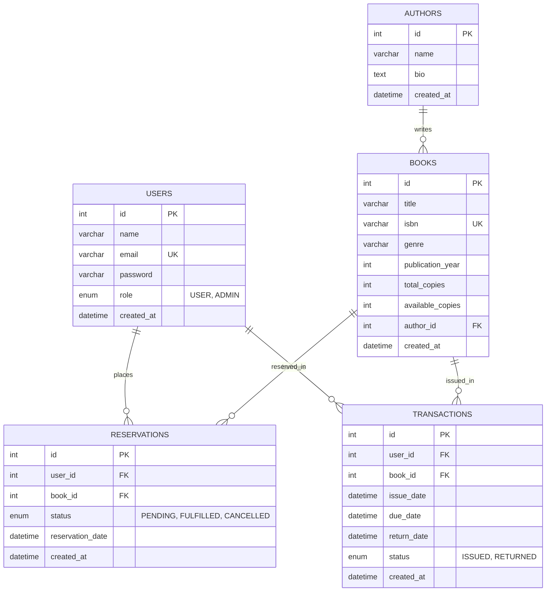

# Online Book Inventory & Reservation System

[](https://nodejs.org/)
[](https://expressjs.com/)
[](https://react.dev/)
[](https://vitejs.dev/)
[](https://www.mysql.com/)
[](LICENSE)
[](docs/testing.md)

A full-stack departmental library management application engineered with **React (Vite)**, **Node.js/Express**, and **MySQL**. The system supports book cataloging, real-time debounced search, author attribution, transaction-safe concurrency-guarded reservations, circulation (issue/return tracking), overdue calculation, and role-based administrative dashboards.

---

## Table of Contents

- [Problem Statement](#problem-statement)
- [Key Features](#key-features)
- [Technology Stack](#technology-stack)
- [System Architecture](#system-architecture)
- [Database Schema & ER Model](#database-schema--er-model)
- [User Roles & Permissions Matrix](#user-roles--permissions-matrix)
- [REST API Reference](#rest-api-reference)
- [Project Directory Structure](#project-directory-structure)
- [Getting Started](#getting-started)
  - [Prerequisites](#prerequisites)
  - [1. Clone Repository](#1-clone-repository)
  - [2. Environment Configuration](#2-environment-configuration)
  - [3. Database Setup](#3-database-setup)
  - [4. Install Dependencies](#4-install-dependencies)
  - [5. Run the Application](#5-run-the-application)
- [Automated Testing & Quality Assurance](#automated-testing--quality-assurance)
- [Git & GitHub Workflow](#git--github-workflow)
- [Security & Production Hardening](#security--production-hardening)

---

## Problem Statement

Academic departments and institutional libraries often suffer from disorganized book circulation, uncoordinated reservations, and manual stock inaccuracies. Missing or delayed returns lead to inventory discrepancies and user frustration.

This system provides a reliable, transaction-safe digital solution that:
1. Tracks inventory in real-time (`total_copies` vs. `available_copies`).
2. Guarantees ACID-compliant reservation holds preventing race conditions.
3. Manages book circulation with automated due dates and overdue calculation.
4. Delivers tailored experiences for regular library patrons and library administrators.

---

## Key Features

### For Library Patrons (USER)
- **Live Catalog & Search**: Instant debounced search by title, author, genre, or ISBN with availability toggles.
- **Book Details & Author Bios**: Comprehensive views of books, publication years, descriptions, and linked author profiles.
- **Transaction-Safe Reservations**: Reserve available books instantly with immediate inventory hold protection.
- **Self-Service Reservation Management**: View active and historical reservations; cancel active reservations with immediate inventory restoration.
- **Circulation History**: Monitor currently issued books, due dates, return statuses, and overdue notices.
- **User Dashboard**: Unified patron overview with profile details, stats, active loans, and reservation lists.

### For Library Administrators (ADMIN)
- **Catalog Management (CRUD)**: Add, edit, and delete books and authors with form validation and dependency safeguards (preventing author deletion with linked titles).
- **Circulation Desk**:
  - Issue books directly or fulfill existing user reservations.
  - Process book returns with automatic status updates (`RETURNED`) and inventory increments.
- **Reservation Oversight**: View all reservations across patrons, inspect timestamps, and cancel reservations if needed.
- **Overdue Monitoring**: Real-time identification of overdue loans past the standard loan duration (14 days).
- **Admin Dashboard**: System-wide statistics (total books, available stock, active reservations, active loans, overdue items).

### System & Engineering Highlights
- **ACID Transaction Safety**: Multi-statement database operations wrapped in `START TRANSACTION`, `COMMIT`, and `ROLLBACK` blocks using a MySQL connection pool.
- **JWT Authentication & Role Authorization**: Secure stateless authentication using `jsonwebtoken` with bcrypt password hashing (10 salt rounds).
- **Defensive Error Handling**: Centralized error middleware returning normalized API error structures (`{ success: false, message, errors }`).
- **Responsive UI/UX**: Built with React Hooks, clean semantic layouts, responsive navigation, loading skeletons, and inline alerts.

---

## Technology Stack

| Layer | Technologies |
|---|---|
| **Frontend** | React 18, Vite 6, React Router DOM v6, React Hooks (`useState`, `useEffect`, `useContext`, `useCallback`, `useMemo`), Vanilla CSS3 |
| **Backend** | Node.js, Express.js 4.21, RESTful API Design |
| **Database** | MySQL 8.0, `mysql2` (with Promises and Connection Pool) |
| **Security** | JSON Web Tokens (`jsonwebtoken`), `bcrypt`, CORS, Environment variable isolation |
| **Testing** | Custom Node.js assertion suites, Mock DOM harness, REST API integration runners |
| **Tooling & VCS**| Git, npm workspaces, VS Code |

---

## System Architecture

```text
┌────────────────────────────────────────────────────────┐
│                   React 18 SPA (Vite)                  │
│  - React Router (Public & Protected Routes)            │
│  - AuthContext (JWT Token & User State Management)     │
│  - Components (Catalog, Search, Dashboards, Forms)     │
└───────────────────────────┬────────────────────────────┘
                            │ HTTP / REST (JSON)
                            ▼
┌────────────────────────────────────────────────────────┐
│                  Express.js 4 REST API                 │
│  - Middleware: CORS, Auth Middleware, Role Guard       │
│  - Controllers: Auth, Books, Authors, Res, Trans       │
│  - Services: Transactional Business & Inventory Logic  │
│  - Error Handling Middleware & Input Sanitization      │
└───────────────────────────┬────────────────────────────┘
                            │ mysql2 Connection Pool
                            ▼
┌────────────────────────────────────────────────────────┐
│                   MySQL 8.0 Database                   │
│  - Tables: users, authors, books, reservations,        │
│            transactions                                │
│  - Foreign Keys, Constraints, Cascades, Indexes        │
└────────────────────────────────────────────────────────┘
```

---

## Database Schema & ER Model



---

## User Roles & Permissions Matrix

| Capability / Resource | Public (Guest) | Registered User | Administrator |
|---|:---:|:---:|:---:|
| User Registration & Login | Yes | Yes | Yes |
| Browse & Search Books | Yes | Yes | Yes |
| View Book & Author Details | Yes | Yes | Yes |
| Reserve Available Book | No | Yes | Yes |
| View Own Dashboard & Loans | No | Yes | Yes |
| Cancel Own Active Reservation | No | Yes | Yes |
| Manage Books (Create, Update, Delete) | No | No | Yes |
| Manage Authors (Create, Update, Delete)| No | No | Yes |
| Issue Book / Fulfill Reservation | No | No | Yes |
| Process Book Returns | No | No | Yes |
| View All Patron Reservations | No | No | Yes |
| View All Circulation Records | No | No | Yes |
| Access Admin Dashboard & Metrics | No | No | Yes |

---

## REST API Reference

All backend endpoints are prefixed with `/api`. Protected routes require `Authorization: Bearer <token>`.

### Authentication (`/api/auth`)
| Method | Endpoint | Access | Description |
|---|---|---|---|
| `POST` | `/api/auth/register` | Public | Register new user account (`name`, `email`, `password`, optional `role`) |
| `POST` | `/api/auth/login` | Public | Authenticate credentials and receive signed JWT |
| `GET` | `/api/auth/profile` | USER / ADMIN | Retrieve authenticated user profile |

### Authors (`/api/authors`)
| Method | Endpoint | Access | Description |
|---|---|---|---|
| `GET` | `/api/authors` | Public | List all authors |
| `GET` | `/api/authors/:id` | Public | Get single author details with linked books |
| `POST` | `/api/authors` | ADMIN | Create new author |
| `PUT` | `/api/authors/:id` | ADMIN | Update author information |
| `DELETE`| `/api/authors/:id` | ADMIN | Delete author (safeguarded against linked books) |

### Books (`/api/books`)
| Method | Endpoint | Access | Description |
|---|---|---|---|
| `GET` | `/api/books` | Public | Search books with query filters (`search`, `author_id`, `available`, `genre`) |
| `GET` | `/api/books/:id` | Public | Get book details including author profile |
| `POST` | `/api/books` | ADMIN | Create new book entry |
| `PUT` | `/api/books/:id` | ADMIN | Update book details and inventory stock |
| `DELETE`| `/api/books/:id` | ADMIN | Delete book |

### Reservations (`/api/reservations`)
| Method | Endpoint | Access | Description |
|---|---|---|---|
| `POST` | `/api/reservations` | USER / ADMIN | Place reservation hold (transaction-safe stock decrement) |
| `GET` | `/api/reservations/my` | USER / ADMIN | Get authenticated user's reservations |
| `PUT` | `/api/reservations/:id/cancel` | USER / ADMIN | Cancel reservation (restores available stock) |
| `GET` | `/api/reservations` | ADMIN | List all reservations with user/book details |

### Transactions / Circulation (`/api/transactions`)
| Method | Endpoint | Access | Description |
|---|---|---|---|
| `POST` | `/api/transactions/issue` | ADMIN | Issue book (with optional reservation fulfillment) |
| `PUT` | `/api/transactions/:id/return` | ADMIN | Return issued book (increments stock) |
| `GET` | `/api/transactions/my` | USER / ADMIN | Get authenticated user's loan history |
| `GET` | `/api/transactions` | ADMIN | List all circulation records (supports `status` filter) |

### Health Check (`/api/health`)
| Method | Endpoint | Access | Description |
|---|---|---|---|
| `GET` | `/api/health` | Public | Server uptime and health probe |

---

## Project Directory Structure

```text
FSD_PROJECT/
├── .env.example                     # Root environment variables template
├── .gitignore                       # Comprehensive Git ignore rules
├── package.json                     # Root orchestrator scripts
├── README.md                        # Primary project documentation
├── database/
│   ├── schema.sql                   # MySQL DDL schema with constraints & indexes
│   ├── seed.sql                     # Initial sample data (admin, users, authors, books)
│   └── README.md                    # Database setup instructions
├── docs/
│   ├── README.md                    # Documentation index
│   ├── testing.md                   # Comprehensive testing guide & QA results
│   └── git-workflow.md              # Branching model, PR process & conventions
├── backend/
│   ├── .env.example                 # Backend environment variable template
│   ├── package.json                 # Backend dependencies & scripts
│   ├── src/
│   │   ├── app.js                   # Express application setup & middleware stack
│   │   ├── server.js                # Server entry point & connection listener
│   │   ├── config/
│   │   │   └── db.js                # mysql2 connection pool configuration
│   │   ├── controllers/
│   │   │   ├── authController.js    # Auth request handlers
│   │   │   ├── authorController.js  # Author CRUD handlers
│   │   │   ├── bookController.js    # Book catalog handlers
│   │   │   ├── reservationController.js
│   │   │   └── transactionController.js
│   │   ├── middleware/
│   │   │   ├── auth.js              # JWT verification middleware
│   │   │   ├── roleCheck.js         # Role-based access control (ADMIN/USER)
│   │   │   └── errorHandler.js      # Global error & 404 handler
│   │   ├── routes/
│   │   │   ├── authRoutes.js
│   │   │   ├── authorRoutes.js
│   │   │   ├── bookRoutes.js
│   │   │   ├── reservationRoutes.js
│   │   │   └── transactionRoutes.js
│   │   ├── services/
│   │   │   ├── authorService.js     # Author SQL queries
│   │   │   ├── bookService.js       # Book query builder & inventory checks
│   │   │   ├── reservationService.js# Transaction-safe reservation operations
│   │   │   └── transactionService.js# Circulation issue & return transactions
│   │   └── utils/
│   │       ├── jwt.js               # JWT signing and verification helpers
│   │       └── validators.js        # Input sanitization and validation rules
│   └── tests/
│       ├── test_auth.js             # Auth unit & integration tests
│       ├── test_authors_books.js    # Catalog & search test suite
│       ├── test_reservations_transactions.js # Concurrency & transaction tests
│       ├── test_error_handling_validation.js # Validation & hardening tests
│       └── test_qa_comprehensive.js # Comprehensive Phase 12 regression harness
└── frontend/
    ├── .env.example                 # Frontend environment template
    ├── package.json                 # Frontend dependencies & scripts
    ├── vite.config.js               # Vite build configuration
    ├── index.html                   # HTML5 shell
    ├── src/
    │   ├── main.jsx                 # React root mount
    │   ├── App.jsx                  # Route definitions & layout wrappers
    │   ├── index.css                # Global stylesheet & design tokens
    │   ├── components/
    │   │   ├── Navbar.jsx           # Global header navigation
    │   │   ├── ProtectedRoute.jsx   # Role-guarded route wrapper
    │   │   ├── BookCard.jsx         # Book display card
    │   │   ├── BookSearch.jsx       # Real-time debounced search bar
    │   │   ├── Alert.jsx            # Dynamic alert banner
    │   │   ├── LoadingSpinner.jsx   # Async loading indicator
    │   │   └── Modal.jsx            # Reusable modal dialog
    │   ├── context/
    │   │   └── AuthContext.jsx      # Authentication & session context
    │   ├── hooks/
    │   │   └── useDebounce.js       # Custom debounce hook for search inputs
    │   ├── pages/
    │   │   ├── Home.jsx             # Welcome page
    │   │   ├── Books.jsx            # Book catalog & live search
    │   │   ├── BookDetail.jsx       # Individual book view & reserve action
    │   │   ├── Authors.jsx          # Author directory & author details
    │   │   ├── Login.jsx            # Authentication form
    │   │   ├── Register.jsx         # Patron registration form
    │   │   ├── Dashboard.jsx        # Patron reservation & loan dashboard
    │   │   ├── AdminDashboard.jsx   # Administrative overview & stats
    │   │   ├── AdminBooks.jsx       # Admin book catalog management
    │   │   ├── AdminAuthors.jsx     # Admin author directory management
    │   │   ├── AdminReservations.jsx# Admin reservation ledger & cancel
    │   │   ├── AdminTransactions.jsx# Admin circulation desk (issue/return)
    │   │   └── NotFound.jsx         # 404 fallback page
    │   └── services/
    │       ├── api.js               # Fetch wrapper with JWT headers & error normalization
    │       ├── authService.js
    │       ├── bookService.js
    │       ├── authorService.js
    │       ├── reservationService.js
    │       └── transactionService.js
    └── tests/
        └── test_frontend_integration.js # 37 integration tests
```

---

## Getting Started

### Prerequisites
- **Node.js**: v18.0.0 or higher
- **npm**: v9.0.0 or higher
- **MySQL**: 8.0 or higher

---

### 1. Clone Repository
```bash
git clone <repository-url>
cd FSD_PROJECT
```

---

### 2. Environment Configuration

#### Backend Configuration
Copy `.env.example` to `backend/.env`:
```bash
cp backend/.env.example backend/.env
```
Edit `backend/.env` with your local MySQL credentials:
```ini
PORT=5000
CLIENT_URL=http://localhost:5173

DB_HOST=localhost
DB_PORT=3306
DB_USER=root
DB_PASSWORD=your_mysql_password
DB_NAME=library_db

JWT_SECRET=your_super_secret_jwt_key_min_32_chars
JWT_EXPIRES_IN=1h

BOOK_LOAN_DAYS=14
```

#### Frontend Configuration
Copy `.env.example` to `frontend/.env`:
```bash
cp frontend/.env.example frontend/.env
```
Ensure `VITE_API_BASE_URL` points to your backend:
```ini
VITE_API_BASE_URL=http://localhost:5000/api
```

---

### 3. Database Setup

Log in to MySQL and execute the schema and seed scripts:
```bash
# Windows PowerShell
Get-Content database/schema.sql | mysql -u root -p
Get-Content database/seed.sql | mysql -u root -p

# Linux / macOS
mysql -u root -p < database/schema.sql
mysql -u root -p < database/seed.sql
```

Default seeded accounts:
| Role | Email | Password |
|---|---|---|
| **Admin** | `admin@library.com` | `Admin@123` |
| **User** | `user1@library.com` | `User@123` |
| **User** | `user2@library.com` | `User@123` |

---

### 4. Install Dependencies

You can install all dependencies from the root directory:
```bash
npm run install:all
```
*Or install manually inside each subfolder:*
```bash
cd backend && npm install
cd ../frontend && npm install
```

---

### 5. Run the Application

#### Start Backend (Terminal 1)
```bash
npm run backend
# Server runs at http://localhost:5000
```

#### Start Frontend (Terminal 2)
```bash
npm run frontend
# Vite dev server runs at http://localhost:5173
```

---

## Automated Testing & Quality Assurance

The application includes **132 automated tests** across 6 test suites covering authentication, CRUD operations, transaction-safe inventory holds, circulation workflows, input validation, and frontend state synchronization.

### Run All Tests (Root)
```bash
npm test
```

### Run Backend Tests Separately
```bash
npm run test:backend
```
Executes:
1. `test_auth.js` (11 tests): Registration, login, JWT validation, profile.
2. `test_authors_books.js` (15 tests): Author/Book CRUD, search, pagination.
3. `test_reservations_transactions.js` (15 tests): Concurrency safety, inventory decrement/increment, issue/return.
4. `test_error_handling_validation.js` (22 tests): Malformed JSON, XSS, boundary conditions.
5. `test_qa_comprehensive.js` (32 tests): Full multi-user concurrent workflows, RBAC integrity.

### Run Frontend Integration Tests
```bash
npm run test:frontend
```
Executes:
- `test_frontend_integration.js` (37 tests): Component rendering, state transitions, hooks, route protection, API contract alignment.

### Production Build Verification
```bash
npm run build:frontend
```
Verifies that all JSX/React modules compile without errors or warnings.

For detailed test reports, methodology, and defect resolution logs, see [docs/testing.md](docs/testing.md).

---

## Git & GitHub Workflow

We maintain a strict Git workflow to keep `master` deployable at all times:

1. **Branching Model**:
   - `master`: Protected release branch.
   - `feature/<name>`: New capabilities (e.g., `feature/book-export`).
   - `fix/<name>`: Bug fixes (e.g., `fix/due-date-calculation`).
   - `chore/<name>`: Build, tooling, documentation updates.
2. **Conventional Commits**: Format commit messages as `<type>(<scope>): <description>`.
3. **Pre-Commit Checks**: Always run `npm test` and `npm run build:frontend` before opening a Pull Request.
4. **Credential Protection**: Never commit `.env` files. Verify `git status` before committing.

Detailed instructions, code review checklists, and merge conflict resolution guides are documented in [docs/git-workflow.md](docs/git-workflow.md).

---

## Security & Production Hardening

- **SQL Injection Prevention**: 100% of database queries use parameterized SQL via `mysql2`.
- **Password Security**: Passwords hashed using `bcrypt` with salt rounds set to 10.
- **XSS & Input Sanitization**: Inputs trimmed, types validated, and HTML-escaped before persistence.
- **Role-Based Authorization**: Middleware verifies both JWT signature and required role before invoking controllers.
- **Transaction Safety**: Financial/inventory updates utilize MySQL transactions (`START TRANSACTION`, `COMMIT`, `ROLLBACK`) to eliminate race conditions under concurrent requests.
- **CORS Restricted**: API only accepts requests from configured `CLIENT_URL`.

---

## License

This project is licensed under the [ISC License](LICENSE).
