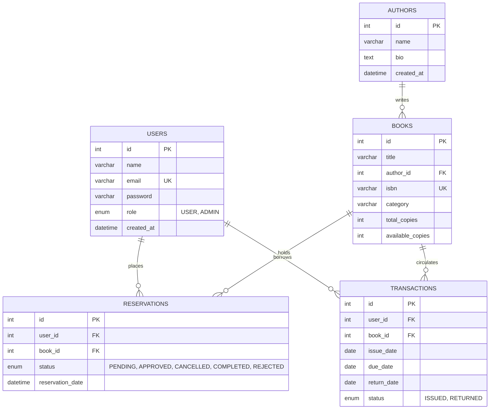

# Final Project Presentation: Slide-by-Slide Deck & Speaker Notes

**Project Title:** Online Book Inventory & Reservation System  
**Presentation Audience:** Project Evaluation Committee, External Examiners, Faculty Guides, and Academic Reviewers  
**Target Duration:** 8–12 Minutes (approximately 25–45 seconds per slide)  
**System Implementation Status:** Completed & Code-Frozen Full-Stack Web Application  

---

## Slide 1 — Title Slide

```text
================================================================================
                ONLINE BOOK INVENTORY & RESERVATION SYSTEM
         A Concurrency-Safe Full-Stack Library Automation Platform
================================================================================

Candidate Information:
• Student Name:       [Student Name / Candidate Full Name]
• Roll Number:        [University / College Roll Number]
• Degree & Branch:    B.Tech in Computer Science & Engineering
• Department:         Department of Computer Science & Engineering
• College / College:  [College of Engineering / Institute Name]
• Project Guide:      [Faculty Guide Name, Designation]
• Academic Year:      2025 – 2026
```

### Key Visuals / Layout
- College logo at top-left.
- Clean typography with professional theme.
- Title and candidate credentials centered.

### What to Say (Speaker Notes ~ 25s)
> *"Respected external examiner, honorable faculty guide, and members of the evaluation committee, good morning. My name is [Student Name], and today I am pleased to present our final year capstone project titled **'Online Book Inventory & Reservation System'**. This project was developed under the guidance of [Guide Name] in the Department of Computer Science and Engineering. It is a full-stack, concurrency-safe web application built using React, Node.js, Express, and MySQL to automate college library cataloging, real-time book discovery, patron reservations, and physical circulation management."*

---

## Slide 2 — Introduction

```text
================================================================================
                              2. INTRODUCTION
================================================================================

• Background:
  - Departmental and institutional libraries serve hundreds of daily patrons.
  - Core circulation activities include cataloging, searching, reserving, 
    issuing, returning, and tracking inventory.

• Project Core Purpose:
  - Replace error-prone manual paper registers and isolated spreadsheets with a 
    centralized, role-governed web application.
  - Provide patrons with instant search, real-time availability status, and 
    transaction-safe online reservations.
  - Empower library administrators with a centralized circulation desk, 
    inventory controls, and automated overdue tracking.
```

### Key Visuals / Layout
- Split screen: Left side shows traditional library challenges; right side shows the modern digital solution.
- Bullet points highlighting core pillars: Inventory, Reservations, Circulation.

### What to Say (Speaker Notes ~ 30s)
> *"In academic institutions, departmental libraries handle high daily traffic of students and faculty borrowing reference books and textbooks. Currently, many libraries still manage transactions through manual paper registers or basic spreadsheets. Our system provides a centralized digital solution. Patrons can browse the catalog from their phones or laptops, verify whether a physical copy is actually on the shelf, and place a hold. On the administrative side, librarians get a unified circulation desk to approve holds, issue loans with automated due dates, and monitor overdue returns."*

---

## Slide 3 — Problem Statement

```text
================================================================================
                           3. PROBLEM STATEMENT
================================================================================

Key Pain Points in Traditional Manual Library Management:

1. Inaccurate Shelf Availability:
   - Patrons cannot see real-time shelf counts before visiting the library physically.
2. Race Conditions & Duplicate Holds:
   - When only one physical copy remains, multiple patrons may attempt to reserve it, 
     leading to double-booking and disputes.
3. Untracked Book Circulation:
   - Manual registers make tracking 14-day loan return due dates cumbersome.
4. Inventory Discrepancies & Negative Stock:
   - Human recording mistakes cause differences between paper records and physical shelf copies.
5. Inefficient Catalog Search:
   - Physical index cards or non-indexed spreadsheets require manual, slow searching.
```

### Key Visuals / Layout
- Warning icons next to each problem point (Double booking, untracked overdue loans, manual errors).

### What to Say (Speaker Notes ~ 35s)
> *"The problem statement originated from observing real library bottlenecks. First, students spend time walking to the library only to discover the required textbook has already been issued. Second, in manual or basic systems, two users might try to reserve the last remaining copy simultaneously, causing double-allocation. Third, tracking loan due dates and finding which books are overdue is labor-intensive when going line-by-line through a paper register. Finally, manual stock adjustments often cause negative or mismatched inventory figures."*

---

## Slide 4 — Objectives

```text
================================================================================
                              4. PROJECT OBJECTIVES
================================================================================

1. Digital Catalog Management:
   - Maintain comprehensive records of books, ISBNs, publication details, and authors.
2. Real-Time Discovery & Availability:
   - Implement fast, debounced live search by title, author, category, or ISBN with 
     instant shelf-stock indicators.
3. Concurrency-Safe Reservation Lifecycle:
   - Allow authenticated patrons to reserve available books using atomic database 
     transactions to eliminate race conditions.
4. End-to-End Circulation Tracking:
   - Provide librarians with a digital checkout desk that automates 14-day loan durations, 
     detects overdue loans, and restores inventory upon return.
5. Strict Role-Based Security:
   - Secure patron and administrative workflows using JWT authentication, bcrypt password 
     hashing, and route authorization guards.
```

### Key Visuals / Layout
- Checklist layout with checkmarks next to each objective, emphasizing that all objectives are fully implemented.

### What to Say (Speaker Notes ~ 30s)
> *"To address these problems, we defined five clear technical objectives: First, digitize the book and author catalog with full relational integrity. Second, build real-time search with availability filtering. Third, implement a concurrency-safe reservation pipeline where the database guarantees that available copies never drop below zero. Fourth, automate the circulation lifecycle, including book issuance, automated 14-day due date calculation, overdue detection, and instant return processing. And fifth, protect all APIs and routes with industry-standard role-based authentication."*

---

## Slide 5 — Existing System vs. Proposed System

```text
================================================================================
                      5. EXISTING VS. PROPOSED SYSTEM
================================================================================

| Dimension             | Existing / Traditional System | Implemented Proposed System     |
|-----------------------|-------------------------------|----------------------------------|
| Record Keeping        | Paper ledgers / Excel sheets  | Relational MySQL 8.0 Database    |
| Search Mechanism      | Manual physical browsing      | Real-time debounced live search  |
| Availability Check    | Physical shelf verification   | Instant real-time UI indicator   |
| Reservation Safety    | Prone to double-booking       | Concurrency-safe SQL transactions|
| Circulation & Due Date| Manual date stamp calculation | Automated 14-day calculation     |
| Overdue Detection     | Manual register audit         | Automated real-time query filter |
| Access Control        | Open / No verification        | JWT & bcrypt role guards         |
```

### Key Visuals / Layout
- Comparison table with contrasting color coding (Red/Gray for manual, Green/Blue for proposed).

### What to Say (Speaker Notes ~ 35s)
> *"This slide summarizes the direct contrast between the existing manual approach and our implemented system. Where the traditional system relies on physical registers and manual stamp calculation, our application provides instant SQL-backed lookups. Where manual reservations suffered from human double-booking errors, our proposed system employs database-level atomic transactions and check constraints. Furthermore, overdue tracking is completely automated rather than requiring hours of manual register inspection."*

---

## Slide 6 — Proposed System Architecture

```text
================================================================================
                       6. PROPOSED SYSTEM ARCHITECTURE
================================================================================

   ┌────────────────────────────────────────────────────────┐
   │                    PATRON / ADMIN                      │
   │               (Desktop / Laptop Browser)               │
   └───────────────────────────┬────────────────────────────┘
                               │ HTTP / JSON
                               ▼
   ┌────────────────────────────────────────────────────────┐
   │                 REACT 18 + VITE (SPA)                  │
   │  - Component Hierarchy (Navbar, Cards, Modals, Forms)  │
   │  - React Router v6 & Role-Guarded Protected Routes     │
   │  - AuthContext (JWT Session Storage in LocalStorage)   │
   │  - Custom Hooks (useDebounce for Live Search API)      │
   └───────────────────────────┬────────────────────────────┘
                               │ RESTful API (Bearer JWT)
                               ▼
   ┌────────────────────────────────────────────────────────┐
   │                NODE.JS + EXPRESS BACKEND               │
   │  - Middleware: Auth Guard, RBAC, Logger, Error Handler │
   │  - Controllers: Request Parsing & Input Validation     │
   │  - Services: ACID Business Logic & Concurrency Control │
   └───────────────────────────┬────────────────────────────┘
                               │ mysql2 Connection Pool
                               ▼
   ┌────────────────────────────────────────────────────────┐
   │                   MYSQL 8.0 DATABASE                   │
   │  - 5 Relational Tables (InnoDB Engine)                 │
   │  - Row-Level Locking (SELECT ... FOR UPDATE)           │
   │  - Check Constraints (0 <= available <= total)         │
   └────────────────────────────────────────────────────────┘
```

### Key Visuals / Layout
- 3-tier architectural flow diagram connecting Client Browser → Node API → MySQL DB.

### What to Say (Speaker Notes ~ 35s)
> *"Here we see the 3-tier architectural design of our application. At the presentation tier, we have a React Single Page Application built with Vite, utilizing React Router and a centralized AuthContext for state management. The client communicates via standard HTTP REST calls with our application tier: a Node.js and Express backend structured into clean routes, controllers, and services. The backend connects to our data tier—a MySQL 8 database—using a high-performance connection pool with row-level locking to safeguard critical inventory updates."*

---

## Slide 7 — Technology Stack

```text
================================================================================
                             7. TECHNOLOGY STACK
================================================================================

• Frontend:
  - React 18: Declarative, component-based user interface.
  - Vite 5: Next-generation fast frontend build tool and dev server.
  - React Router v6: Client-side routing with role-guarded routes.
  - CSS3 Design Tokens: Responsive design without heavy CSS frameworks.

• Backend:
  - Node.js (v20+): Event-driven, asynchronous JavaScript runtime.
  - Express.js (v4): Layered RESTful API framework.
  - mysql2: Connection-pooled MySQL driver with Promise support.

• Database:
  - MySQL 8.0: Relational DBMS with InnoDB transactional storage engine.

• Security & Utilities:
  - JSON Web Tokens (jsonwebtoken): Stateless Bearer token authorization (24h).
  - bcryptjs: One-way salted password hashing (10 salt rounds).
  - dotenv & cors: Environment configuration and Cross-Origin control.

• Engineering Tools & Version Control:
  - Git & GitHub: Version control following Conventional Commits.
  - Node Test Runner: Native automated unit, integration, and QA test harnesses.
```

### Key Visuals / Layout
- Clean categorical grid displaying technology logos/badges: React, Vite, Node, Express, MySQL, JWT, Git.

### What to Say (Speaker Notes ~ 30s)
> *"For our technology stack, we selected industry-standard tools. On the frontend, we use React 18 bundled with Vite 5 for instant hot-module replacement and optimized production builds. On the backend, we run Node.js with Express, providing an asynchronous, non-blocking I/O runtime. For persistent storage, we use MySQL 8 with the InnoDB engine for full ACID compliance. Authentication relies on bcryptjs for one-way password hashing and JSON Web Tokens for stateless session verification. Everything is tracked in Git using clean Conventional Commits."*

---

## Slide 8 — System Architecture & Layering

```text
================================================================================
                    8. SYSTEM ARCHITECTURE & CODE LAYERING
================================================================================

• Frontend Layering:
  ├── Components: Reusable UI blocks (Navbar, BookCard, Modal, Alert, Spinner)
  ├── Pages: Views for Public, Patron Dashboard, and Admin Consoles
  ├── Services: Axios/Fetch API wrappers with authorization headers
  └── Context: AuthContext managing user profile, role, and JWT token

• Backend Layering (Separation of Concerns):
  ├── Routes: Define HTTP endpoints and bind authentication/role middleware
  ├── Middleware: authMiddleware (JWT verify), roleMiddleware (RBAC guard)
  ├── Controllers: HTTP request parsing, status codes, and JSON responses
  ├── Services: Core business logic, transaction boundaries, and SQL queries
  └── Config / Pool: Reusable MySQL connection pool (10 connections max)
```

### Key Visuals / Layout
- Layered architectural diagram showing strict separation of concerns from routes down to the database pool.

### What to Say (Speaker Notes ~ 35s)
> *"This slide highlights the strict separation of concerns implemented across the codebase. In the backend, we do not write database queries inside route handlers. Instead, HTTP routes pass requests through our authentication and role middleware into Controllers. Controllers validate input and call dedicated Services. Services encapsulate our business logic, manage SQL transaction boundaries, and execute parameterized queries via the database pool. On the frontend, pages consume reusable components and access backend APIs through abstracted service modules."*

---

## Slide 9 — Database Design & Schema

```text
================================================================================
                          9. DATABASE DESIGN (SCHEMA)
================================================================================


```

### Key Visuals / Layout
- Clean Entity-Relationship (ER) diagram representing the 5 core tables and their cardinality.

### What to Say (Speaker Notes ~ 40s)
> *"Our database schema consists of five relational tables designed in Third Normal Form. The `users` table stores patron and administrator credentials with role enumeration. The `authors` table relates one-to-many with the `books` table, protected by an `ON DELETE RESTRICT` foreign key constraint to prevent orphaned book records. When a patron places a hold, a row is created in `reservations` referencing both `users` and `books`. When a book is physically issued, a record is added to `transactions`, tracking the issue date, the automated 14-day due date, and the return date upon check-in."*

---

## Slide 10 — Authentication & Authorization

```text
================================================================================
                  10. AUTHENTICATION & ROLE AUTHORIZATION
================================================================================

• Authentication (Identity Verification):
  - Registration: Validates name, email format, and password length (>= 6 chars).
  - Password Security: Hashed with bcryptjs (10 salt rounds); plain-text passwords 
    are NEVER stored or logged.
  - Login: Verifies credentials and generates a signed JSON Web Token (24h lifespan).

• Authorization (Permission Enforcement):
  - Client-Side: ProtectedRoute wrapper redirects unauthorized users based on role.
  - Server-Side: authMiddleware verifies Bearer token from HTTP headers.
  - Role Guard: roleMiddleware('ADMIN') enforces administrative-only API access.

• Authentication vs. Authorization:
  - Authentication asks: "Who are you?" (Resolved via JWT token payload).
  - Authorization asks: "What are you allowed to do?" (Resolved via RBAC middleware).
```

### Key Visuals / Layout
- Flowchart illustrating Login Request → Password Verify → Token Sign → Request Header Authorization → Protected Resource.

### What to Say (Speaker Notes ~ 35s)
> *"Security is implemented using a two-pillar model: Authentication and Authorization. For authentication, patron passwords are encrypted using bcrypt with ten salt rounds so plain-text passwords never enter the database. Upon login, the server issues a signed JSON Web Token. For authorization, we distinguish between who the user is and what they are permitted to do. Protected routes in React check the token in client state, while backend middleware inspects the JWT payload on every API request. If a student attempts to call an admin endpoint, the server returns an immediate HTTP 403 Forbidden."*

---

## Slide 11 — Book & Author Management

```text
================================================================================
                     11. BOOK & AUTHOR MANAGEMENT
================================================================================

• Author Management (Admin Controlled):
  - Administrators can create, view, update, and delete author profiles.
  - Referential Integrity Protection: Deleting an author with existing associated books 
    is blocked with HTTP 409 Conflict to protect database consistency.

• Book Catalog Management:
  - Full CRUD capabilities: Title, Author, ISBN-10/13, Category, Total Copies.
  - Stock Consistency: Total copies and available copies are independently tracked.
  - Stock Checks: Available copies can never exceed total copies or fall below zero.

• Patron View:
  - Read-only access to catalog and author biographies with real-time stock indicators.
```

### Key Visuals / Layout
- Side-by-side view of Patron Catalog browsing and Administrator Book Edit Modal.

### What to Say (Speaker Notes ~ 30s)
> *"The book and author management module allows librarians to maintain an up-to-date catalog. When adding a book, the admin specifies title, category, unique ISBN, and total stock. When editing, stock adjustments automatically validate that available copies do not exceed total copies. Author profiles include biographies and cross-reference all written books. Crucially, referential integrity is preserved: if an admin tries to delete an author whose books exist in the catalog, the database rejects the request with a clear error message, preventing orphaned records."*

---

## Slide 12 — Search & Availability Filtering

```text
================================================================================
                   12. REAL-TIME SEARCH & AVAILABILITY
================================================================================

• Search Capabilities:
  - Multi-attribute search across: Title, Author Name, ISBN, and Category.
  - Query construction uses SQL `LIKE %term%` queries with parameterized inputs.

• Live Search Optimization (useDebounce):
  - React state captures user keystrokes instantly.
  - Custom `useDebounce` hook introduces a 300ms delay before issuing the API request.
  - Prevents network congestion: Typing a 10-letter word triggers 1 API call instead of 10.

• Availability Filter:
  - One-click checkbox filter: Instantly isolates titles with `available_copies > 0`.
  - Empty-state fallbacks: Displays friendly guidance when no matching titles are found.
```

### Key Visuals / Layout
- Graphic explaining the Debounce timeline (Keystroke sequence vs. single delayed API dispatch).

### What to Say (Speaker Notes ~ 35s)
> *"To ensure a smooth user experience, we implemented a real-time live search. As a user types, our custom React `useDebounce` hook buffers the input for 300 milliseconds. This ensures that typing a 10-character title triggers only a single optimized API request rather than ten unnecessary backend calls. The search scans across book titles, authors, categories, and ISBNs simultaneously. Users can also toggle an 'Available Only' filter, which immediately excludes books that are currently out of stock."*

---

## Slide 13 — Reservation System

```text
================================================================================
                         13. RESERVATION LIFECYCLE
================================================================================

Patron Workflow:
  1. Browse Catalog → View Book Details.
  2. Click 'Reserve Book' (Only if available_copies > 0).
  3. Duplicate Hold Check: If user already has an active hold → HTTP 409 Conflict.
  4. Reservation Created with Status: PENDING.

Administrator Workflow:
  5. Librarian reviews active holds in the Admin Reservation Ledger.
  6. Admin clicks 'Approve' → Status transitions: PENDING → APPROVED.
  7. Upon physical book collection, issuing the book transitions hold → COMPLETED.

Cancellation / Rejection:
  - Patrons can cancel their own PENDING reservations.
  - Admins can cancel or reject holds, returning reserved inventory to the shelf.
```

### Key Visuals / Layout
- State Transition Diagram: `PENDING` ➔ `APPROVED` ➔ `COMPLETED` (or `CANCELLED` / `REJECTED`).

### What to Say (Speaker Notes ~ 35s)
> *"The reservation system manages the complete lifecycle of a book hold. A student finds an available book and places a reservation. The backend first checks if the student already has an active hold on that book; if so, duplicate reservation is prevented. Once submitted, the reservation enters a 'PENDING' status. The librarian reviews the hold in their dashboard and marks it 'APPROVED'. When the student arrives at the circulation counter, issuing the physical copy transitions the reservation to 'COMPLETED'. Patrons can also cancel pending reservations directly from their dashboard."*

---

## Slide 14 — Circulation, Issue/Return & Inventory Protection

```text
================================================================================
               14. CIRCULATION & INVENTORY PROTECTION (ACID)
================================================================================

• Issue Workflow:
  - Admin enters/selects Patron and Book (or fulfills an approved reservation).
  - System executes: `START TRANSACTION`.
  - Queries physical stock with row lock: `SELECT ... FOR UPDATE`.
  - Decrements `available_copies = available_copies - 1`.
  - Inserts transaction: `status = 'ISSUED'`, `issue_date = CURDATE()`, 
    `due_date = CURDATE() + 14 DAYS`.
  - Commits transaction (`COMMIT`).

• Return Workflow:
  - Admin clicks 'Process Return' on active loan.
  - Updates transaction: `status = 'RETURNED'`, `return_date = CURDATE()`.
  - Increments physical stock: `available_copies = available_copies + 1`.

• Inventory Safety Invariants (Database Level):
  - `chk_available_copies`: CHECK (available_copies >= 0)
  - `chk_copies_valid`: CHECK (available_copies <= total_copies)
```

### Key Visuals / Layout
- Flow diagram demonstrating atomic `START TRANSACTION`, `SELECT FOR UPDATE`, and `COMMIT` execution.

### What to Say (Speaker Notes ~ 40s)
> *"Circulation is the heart of library operations and requires absolute transaction safety. When a book is issued, the backend opens an ACID transaction and applies an InnoDB row-level lock using `SELECT ... FOR UPDATE`. It verifies available copies, decrements stock by one, and creates a loan record stamped with an automatic 14-day due date. When the book is returned, the system marks the loan returned and increments available copies. At the database level, MySQL check constraints guarantee that available stock can never be negative or exceed total copies under any concurrent load."*

---

## Slide 15 — User & Admin Dashboards

```text
================================================================================
                    15. USER VS. ADMIN DASHBOARDS
================================================================================

• Patron Dashboard (`/dashboard`):
  - Personal Profile: Name, email, enrolled membership role.
  - Active Holds Ledger: Real-time status badges (PENDING, APPROVED), reservation date, 
    and one-click cancellation button.
  - Loan History: Active loans, 14-day due dates, overdue warnings, and past returned books.

• Administrator Dashboard (`/admin`):
  - Metric Summary Cards: Total Titles, Total Inventory, Active Holds, Books on Loan, Overdue Count.
  - Book Management Console: Add, edit, delete books with stock adjustment controls.
  - Author Management Console: Add, view, edit authors with referential dependency protection.
  - Reservation Ledger: Institutional oversight to approve, reject, or fulfill holds.
  - Circulation Desk: Check-out interface, return processing, and overdue loan monitoring.
```

### Key Visuals / Layout
- Side-by-side screenshots or UI wireframes of Patron Dashboard vs. Admin Dashboard.

### What to Say (Speaker Notes ~ 35s)
> *"We designed tailored dashboards for both roles. The patron dashboard provides students with immediate transparency: they can see their active reservations, check approval statuses, cancel pending requests, and track their personal borrowing history with due dates. The administrator dashboard serves as a complete command center: top metric cards show total inventory and active loans, while dedicated management tabs allow librarians to curate books and authors, approve reservations, and process checkouts and returns."*

---

## Slide 16 — Error Handling, Validation & Security

```text
================================================================================
             16. ERROR HANDLING, VALIDATION & SECURITY
================================================================================

• Robust Multi-Layer Validation:
  - Frontend: Controlled React forms provide instant feedback before network calls.
  - Backend: Route validator utilities enforce required fields, positive integers, 
    valid email regex, and ISBN formats.

• Centralized Error Middleware:
  - All asynchronous service calls are wrapped in an `asyncHandler`.
  - Global error handler catches exceptions, logs them server-side, and returns 
    predictable JSON responses with standard HTTP status codes:
    (400 Bad Request, 401 Unauthorized, 403 Forbidden, 404 Not Found, 409 Conflict, 500 Server Error).

• Security Hardening:
  - Zero SQL Injection: 100% parameterized queries (`?` placeholders).
  - Zero Plaintext Passwords: Salted bcrypt hashes.
  - Environment Isolation: Zero secrets in source code; `.env` excluded via `.gitignore`.
```

### Key Visuals / Layout
- Security shield graphic highlighting 4 badges: Parameterized SQL, Centralized Error Handling, Salted bcrypt, Zero Hardcoded Secrets.

### What to Say (Speaker Notes ~ 35s)
> *"Robustness and security were treated as first-class requirements. We implemented multi-layer validation: client-side controlled forms catch empty fields, while backend validators inspect every incoming payload. All backend routes use centralized error middleware wrapped in an `asyncHandler`, ensuring unhandled rejections never crash the server. Security-wise, SQL injection is completely prevented through 100% parameterized queries. Passwords are never stored in plaintext, and sensitive credentials are isolated in environment variables with strict git-ignore rules."*

---

## Slide 17 — Testing & Verification Results

```text
================================================================================
                    17. TESTING & VERIFICATION RESULTS
================================================================================

• Automated Backend Test Suites (Node Test Runner):
  1. Auth & Profile Suite:          11 / 11 PASS  (Registration, login, bcrypt, JWT)
  2. Catalog & Authors Suite:       15 / 15 PASS  (CRUD, joins, pagination, search)
  3. Reservations & Circulation:    15 / 15 PASS  (ACID holds, 14-day loans, returns)
  4. Validation & Error Hardening:  22 / 22 PASS  (Malformed JSON, boundaries, 404s)
  5. Comprehensive QA & Concurrency:32 / 32 PASS  (Race conditions, stock locks)
  6. Database State Verification:    6 /  6 PASS  (DDL schema, check constraints)
  7. End-to-End Verification:       54 / 54 PASS  (Multi-user end-to-end flows)

• Automated Frontend Integration Suite:
  8. Frontend UX & State Harness:   37 / 37 PASS  (Debounce, state sync, RBAC routing)

• Summary:
  - Total Verified Assertions: 192+ | Failures: 0 | Pass Rate: 100.0%
  - Production Build: Vite production compilation completed cleanly in ~8.18s.
```

### Key Visuals / Layout
- Verification metrics bar chart showing 100% pass across all 8 suites; screenshot of terminal green test run.

### What to Say (Speaker Notes ~ 35s)
> *"To ensure academic and engineering rigor, the entire application was subjected to comprehensive automated testing. We developed eight test suites covering 192 individual verifications across unit, integration, concurrency, and end-to-end layers. These tests proved that race conditions on the last available book are prevented, duplicate holds are rejected, and stock counts remain mathematically exact. All 192 tests pass with a 100% success rate, and our frontend compiles into an optimized production bundle with zero warnings or errors."*

---

## Slide 18 — Conclusion & Future Scope

```text
================================================================================
                    18. CONCLUSION & FUTURE SCOPE
================================================================================

• Conclusion:
  - Successfully designed, implemented, tested, and code-frozen a robust, 
    concurrency-safe Online Book Inventory & Reservation System.
  - Fully fulfills all defined functional and security requirements for modern 
    departmental library operations.
  - Delivers a clean, accessible user interface paired with an ACID-compliant backend.

• Future Scope (Post-Academic Enhancements):
  1. Automated Notifications: Email/SMS loan reminders via Nodemailer / Twilio.
  2. Fine Management: Automated overdue fee calculation with online payment gateway.
  3. Barcode & QR Scanner: Web-camera based scanning for rapid checkout.
  4. Advanced Analytics: Borrowing trends, peak hour charts, and PDF audit exports.
  5. Mobile Application: Cross-platform companion app using React Native.
```

### Key Visuals / Layout
- Summary recap checklist on left; roadmap visual with future feature icons on right.

### What to Say (Speaker Notes ~ 40s)
> *"In conclusion, we have delivered a complete, fully functioning, and concurrency-safe Online Book Inventory and Reservation System. The system replaces error-prone manual bookkeeping with automated, role-governed digital workflows, ensuring accurate inventory records and a frictionless borrowing experience for students and staff. Looking ahead to future scope, the platform can be extended with automated email notifications for upcoming return dates, barcode scanner integration for rapid physical checkout, and fine management with online payment gateways. Thank you, and we are now ready for the demonstration and your questions."*

---
