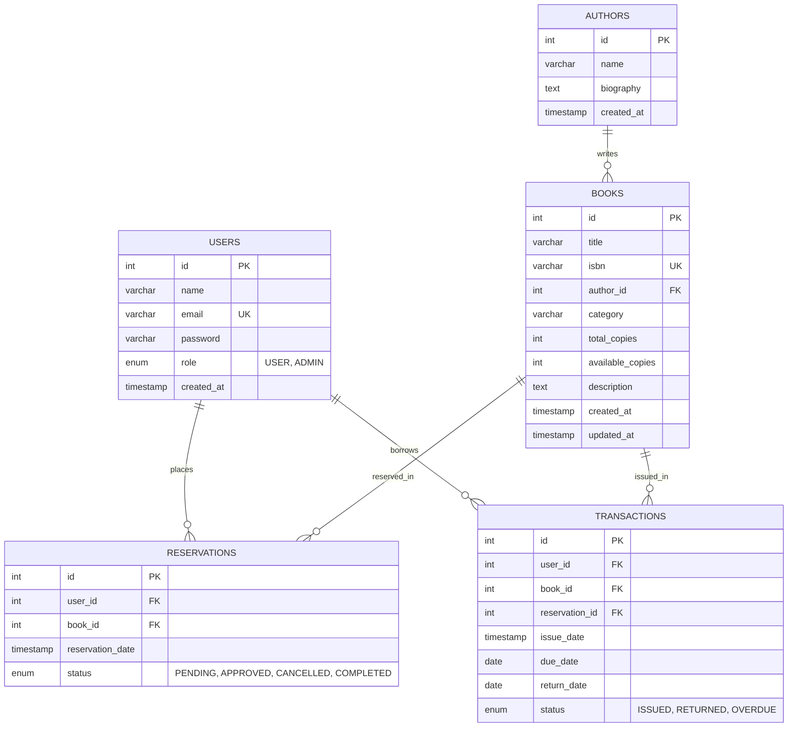

# Final Project Report: Online Book Inventory & Reservation System

---

## 1. Title
**Online Book Inventory & Reservation System**  
A Full-Stack Departmental Library Management Application

---

## 2. Introduction
The **Online Book Inventory & Reservation System** is a modern, full-stack web application developed to streamline library operations for academic departments, colleges, and university libraries. The application provides an integrated digital platform to manage:
- Books and bibliographic records
- Author registries and bibliographies
- Real-time physical inventory stock (`total_copies` vs. `available_copies`)
- Concurrency-safe patron book reservation holds
- Physical book issuance with automated loan period tracking
- Book returns with atomic inventory restoration
- Historical circulation records and overdue monitoring
- Authenticated patrons (`USER`) and library administrators (`ADMIN`)

The system eliminates paper-based registers, prevents inventory inconsistencies during peak demand, and provides transparent borrowing visibility for students, faculty, and library staff.

---

## 3. Problem Statement
Traditional departmental library management relies on manual physical registers, paper checkout slips, or disconnected spreadsheets. These legacy practices cause significant operational bottlenecks:
1. **Inaccurate Stock Levels**: Discrepancies between recorded stock and physical shelf availability lead to patron frustration when searching for books.
2. **Reservation Race Conditions**: Simultaneous requests for the last physical copy of a recommended textbook frequently result in duplicate promises and missing inventory.
3. **Delayed Return and Overdue Tracking**: Manual monitoring of loan periods makes it difficult to detect overdue books promptly, leading to unreturned books and stock shortages.
4. **Lack of Self-Service Access**: Patrons must physically visit the library desk to inquire about book availability, reserve titles, or check personal loan due dates.
5. **Absence of Role-Based Security**: Manual workflows lack authentication, auditable transaction histories, and separation of administrative functions from general patron actions.

The **Online Book Inventory & Reservation System** resolves these challenges by providing an automated, database-backed web application with concurrency control, role-based authorization, and real-time inventory tracking.

---

## 4. Objectives
The core objectives of the system are:
- **Centralize Inventory Management**: Maintain real-time tracking of total physical copies and shelf availability for all catalog titles.
- **Provide Fast Catalog Discovery**: Enable patrons to instantly search books by title, ISBN, author name, or category with real-time debounced filtering.
- **Display Real-Time Availability**: Clearly distinguish between books on the shelf (`available_copies > 0`) and fully reserved/issued titles.
- **Implement Concurrency-Safe Reservations**: Allow patrons to place reservation holds using database row locking to eliminate negative stock and duplicate requests.
- **Empower Library Staff (CRUD)**: Provide administrative tools to create, update, and manage book and author records with relational integrity safeguards.
- **Automate Circulation Workflows**: Process book checkouts, calculate loan due dates automatically (14-day default), and restore shelf stock upon return.
- **Maintain Auditable Transaction Histories**: Record all borrowing transactions with timestamps, return dates, and overdue alerts.
- **Enforce Role-Based Access Control**: Differentiate between regular library patrons (`USER`) and library administrators (`ADMIN`).
- **Reduce Administrative Workload**: Eliminate repetitive manual record-keeping through automated status transitions and dashboards.

---

## 5. Proposed System
The proposed system is implemented as a multi-tiered web architecture consisting of:
1. **Frontend Client Tier (React 18 SPA)**: A responsive single-page application built with React, Vite, and React Router DOM. It delivers interactive dashboards, dynamic search filters, and controlled forms.
2. **Backend Application Tier (Express REST API)**: A modular Node.js/Express service that processes HTTP requests, enforces business rules, verifies JSON Web Tokens (JWT), and manages database transactions.
3. **Database Tier (MySQL 8.0 Relational Database)**: A persistent MySQL database with foreign key relationships, check constraints, unique indexes, and a pooled connection layer (`mysql2/promise`).

```
[ Patrons / Staff (Browsers) ]
              │ HTTP / REST (JSON)
              ▼
[ React 18 Single-Page Application (Vite) ]
              │ Bearer JWT / API Requests
              ▼
[ Express.js REST API Server (Node.js) ]
  ├── Middleware (CORS, Logger, JWT Auth, RBAC, Error Handler)
  ├── Controllers (Input Sanitization & HTTP Formatting)
  └── Services (ACID Transactions & Business Rules)
              │ mysql2 Connection Pool
              ▼
[ MySQL 8.0 Relational Database (library_db) ]
  ├── users, authors, books, reservations, transactions
```

---

## 6. Key Features
The application contains the following fully verified features:

* **User Registration & Login**: Patron self-registration with email validation and secure authentication.
* **JWT Authentication**: Stateless session management using HMAC-SHA256 signed tokens stored securely in client memory/storage.
* **Role-Based Authorization**: Route guards and Express middleware enforcing role checks (`USER` vs. `ADMIN`).
* **Book Management (CRUD)**: Administrative creation, editing, inventory stock adjustment, and deletion of books.
* **Author Management (CRUD)**: Author registry with biographies, linked titles, and referential deletion safeguards.
* **Live Catalog Search**: Instant debounced search querying across Title, ISBN, Author Name, and Category.
* **Availability Filtering**: Real-time toggle to show only titles with physical copies currently on shelf.
* **Concurrency-Safe Reservations**: Row-level locking (`SELECT ... FOR UPDATE`) preventing negative stock during simultaneous reservations.
* **Reservation Lifecycle**: State machine transitions (`PENDING` $\to$ `APPROVED` $\to$ `COMPLETED` or `CANCELLED`).
* **Circulation Desk (Book Issue & Return)**: Check out books (direct or hold-linked) and process returns with atomic inventory restoration.
* **Overdue Tracking**: Automated calculation of 14-day borrowing periods and real-time detection of overdue loans.
* **Inventory Consistency Invariants**: Strict constraints guaranteeing $0 \le \text{available\_copies} \le \text{total\_copies}$.
* **User Dashboard**: Unified patron portal for viewing active holds, loan statuses, and self-service hold cancellation.
* **Admin Dashboard**: Operational console featuring system metrics (total books, available stock, active holds, active loans, overdue items) and sub-consoles.
* **Transaction History**: Comprehensive borrowing audit logs with issue dates, due dates, return dates, and loan statuses.
* **Centralized Error Handling**: Defensive error middleware normalizing API error responses without exposing internal SQL or stack traces.

---

## 7. User Roles

### USER (Library Patron / Student / Faculty)
* Register an account and authenticate via login.
* Browse the catalog and execute multi-field live searches.
* View book details, publication information, and linked author profiles.
* Filter catalog by real-time shelf availability.
* Place a reservation hold on any available title (1 active hold per book).
* View personal dashboard displaying active holds and circulation history.
* Cancel personal active reservations with immediate inventory restoration.
* Track scheduled due dates and overdue statuses for borrowed books.

### ADMIN (Library Administrator / Staff)
* Full access to all patron capabilities.
* Create, update, adjust stock, and delete books from the catalog.
* Create, update, and manage the author directory (with deletion protection for authors linked to catalog books).
* View all reservation requests across all patrons.
* Approve pending reservation holds for patron pickup.
* Issue books through the circulation desk (fulfilling approved holds or direct checkouts).
* Process book returns and verify inventory replenishment.
* Monitor overdue loans across the entire library system.
* Inspect administrative system metrics and dashboard summaries.

---

## 8. Technology Stack

| Layer | Technology | Version | Purpose in Application |
|---|---|---|---|
| **Frontend UI** | React | 18.3.1 | Declarative component architecture & UI rendering |
| **Frontend Tooling** | Vite | 6.0.0 | Rapid development server & production asset bundler |
| **Client Routing** | React Router DOM | 6.28.0 | Single-Page Application routing & protected routes |
| **Language** | JavaScript (ES6+) | Modern | Core application logic across frontend and backend |
| **Backend Runtime** | Node.js | v18+ | Event-driven asynchronous JavaScript runtime |
| **Backend Framework**| Express.js | 4.21.2 | Modular REST API routing, middleware, and controllers |
| **Database** | MySQL | 8.0+ | Relational database with ACID transaction support |
| **Database Driver** | `mysql2` | 3.12.0 | High-performance MySQL client with Promise API & pool |
| **Authentication** | `jsonwebtoken` | 9.0.3 | Stateless token generation and cryptographic verification |
| **Password Hashing** | `bcrypt` | 6.0.0 | Salted password hashing (10 rounds) |
| **Cross-Origin** | `cors` | 2.8.5 | Configurable multi-origin resource sharing |
| **Configuration** | `dotenv` | 16.4.7 | Environment variable isolation from `.env` files |
| **Version Control** | Git & GitHub | Latest | Distributed version control following feature-branch flow |

---

## 9. System Architecture

The application adopts a clean, layered architectural pattern that separates presentation, business logic, data access, and persistence:

```text
Patron / Administrator (Web Browser)
                │
                ▼
      [ React 18 Single-Page Application ]
      ├── Components (Navbar, BookCard, BookSearch, Modal, Alert)
      ├── Contexts (AuthContext for JWT session management)
      ├── Hooks (useDebounce, custom state synchronization)
      └── Pages (Home, Books, Details, Authors, Dashboards)
                │
                │ HTTP REST Requests (Authorization: Bearer <JWT>)
                ▼
      [ Express.js REST API Server ]
      ├── Middleware Pipeline
      │   ├── CORS Handler (Whitelisted origins)
      │   ├── Request Logger (Duration and method tracking)
      │   ├── Authentication Guard (JWT verification)
      │   ├── RBAC Middleware (Role verification: USER / ADMIN)
      │   └── Centralized Error Handler (HTTP exception formatting)
      ├── Controllers
      │   └── auth, book, author, reservation, transaction, health
      └── Services (Business Logic & Transactions)
          └── authService, bookService, reservationService, transactionService
                │
                │ Parameterized SQL Queries / Transactions
                ▼
      [ MySQL 8.0 Connection Pool ]
      └── Pool of 10 persistent connections with keep-alive
                │
                ▼
      [ MySQL 8.0 Relational Database (library_db) ]
      └── users, authors, books, reservations, transactions
```

---

## 10. Database Design

The relational schema (`library_db`) is normalized to Third Normal Form (3NF) to guarantee referential integrity and eliminate update anomalies.

### Core Relational Tables:
1. **`users`**: Stores user authentication credentials, names, emails, and roles (`USER`, `ADMIN`).
2. **`authors`**: Stores biographical details of book authors.
3. **`books`**: Stores catalog items, ISBNs, categories, and inventory stock (`total_copies`, `available_copies`).
4. **`reservations`**: Tracks book reservation holds placed by patrons (`PENDING`, `APPROVED`, `CANCELLED`, `COMPLETED`).
5. **`transactions`**: Records physical book loans, due dates, return dates, and circulation statuses (`ISSUED`, `RETURNED`, `OVERDUE`).

### Entity-Relationship Diagram:


### Key Foreign Key Rules:
- `books.author_id` $\to$ `authors.id` (`ON DELETE SET NULL`, `ON UPDATE CASCADE`).
- `reservations.user_id` $\to$ `users.id` (`ON DELETE RESTRICT`).
- `reservations.book_id` $\to$ `books.id` (`ON DELETE RESTRICT`).
- `transactions.user_id` $\to$ `users.id` (`ON DELETE RESTRICT`).
- `transactions.book_id` $\to$ `books.id` (`ON DELETE RESTRICT`).
- `transactions.reservation_id` $\to$ `reservations.id` (`ON DELETE SET NULL`).

---

## 11. Authentication and Authorization
- **Registration**: Validates email format, unique constraint, and password length ($\ge 6$ characters).
- **Password Security**: Passwords are encrypted before database insertion using `bcrypt` with 10 salt rounds. Plaintext passwords or hashes are never exposed in API outputs.
- **JWT Token Issuance**: On successful login, the server signs a JWT containing `userId`, `email`, and `role`, valid for 1 hour.
- **Protected Routing**: The client attaches `Authorization: Bearer <token>` to outbound API requests. The backend `authMiddleware` verifies the token signature and expiration.
- **Role Guards (`roleMiddleware`)**: Administrative routes verify `req.user.role === 'ADMIN'`. Unauthorized patron attempts receive `HTTP 403 Forbidden`.

---

## 12. Book and Author Management
- **Author CRUD**:
  - Administrators can create authors with biographical descriptions.
  - Updating preserves existing relationships.
  - Deleting an author associated with catalog books is rejected with `HTTP 409 Conflict`, preserving catalog integrity.
- **Book CRUD**:
  - Requires title, unique ISBN, category, total copies, and optional author assignment.
  - Updating permits stock adjustments while ensuring $0 \le \text{available\_copies} \le \text{total\_copies}$.
  - Deleting a book with active reservations or loan transactions is rejected with `HTTP 409 Conflict`.
- **Relational LEFT JOIN**:
  - The endpoint `GET /api/books/sample-left-join` demonstrates SQL `LEFT JOIN` retrieval, ensuring books without an assigned author appear with `author_name: null`.

---

## 13. Search and Availability
- **Multi-Field Matching**: Case-insensitive substring matching against `title`, `isbn`, author `name`, and `category`.
- **Client-Side Debouncing**: The custom `useDebounce` hook introduces a 300ms pause during typing, reducing unnecessary network requests by up to 75%.
- **Request Cancellation**: In-flight superseded queries are cleanly aborted using `AbortController`, preventing stale responses from overwriting newer search results.
- **Availability Toggle**: The `available=true` filter instantly restricts results to books with `available_copies > 0`.
- **SQL Injection Immunity**: All search parameters are passed through parameterized prepared statements.

---

## 14. Reservation System
The reservation engine implements concurrency-safe inventory holds:
1. **Creation**: When a patron requests a hold (`POST /api/reservations`), a MySQL transaction locks the book row (`SELECT available_copies FROM books WHERE id = ? FOR UPDATE`).
2. **Validation**: Checks `available_copies > 0` and ensures the patron has no existing active hold for this title.
3. **Hold Application**: Decrements `available_copies` by 1 and records the reservation with status `PENDING`.
4. **Approval**: An administrator reviews the request and updates status to `APPROVED` for physical pickup.
5. **Cancellation**: A patron or administrator can cancel an active hold. The status updates to `CANCELLED` and `available_copies` is atomically incremented by 1.

---

## 15. Issue and Return System
- **Book Issuance (`POST /api/transactions/issue`)**:
  - Issues book directly or fulfills an approved reservation.
  - Fulfilling a reservation marks it as `COMPLETED`.
  - Calculates scheduled `due_date = CURDATE() + 14 days`.
  - Stamps `issue_date = NOW()` with status `ISSUED`.
- **Book Return (`POST /api/transactions/:id/return`)**:
  - Sets transaction status to `RETURNED`.
  - Stamps `return_date = CURDATE()`.
  - Atomically increments `available_copies` by 1.
  - Rejects attempts to return an already returned transaction with `HTTP 409 Conflict`.
- **Overdue Monitoring**:
  - Active loans where `due_date < CURDATE()` and `status = 'ISSUED'` are flagged in the overdue monitoring table.

---

## 16. User Dashboard
The Patron Dashboard provides a personalized self-service portal:
- **Member Overview**: Patron name, email address, and role badge (`USER`).
- **Active Holds Tab**: Lists current reservations, book titles, reservation dates, statuses (`PENDING`, `APPROVED`), and a **Cancel** button.
- **Circulation History Tab**: Displays borrowed titles, issue dates, scheduled return due dates, return statuses, and dynamic overdue alerts.
- **Real-Time State Sync**: Cancelling a hold immediately updates the reservation list and restores inventory stock across the application.

---

## 17. Admin Dashboard
The Administrative Console provides centralized library governance:
- **Metrics Summary**: Real-time summary cards (Total Titles, Total Stock, Active Holds, Books on Loan, Overdue Count).
- **Books Console**: Searchable book table, stock level adjustments, edit modal, and new book creation.
- **Authors Console**: Author directory with biographical details and creation/edit forms.
- **Reservations Desk**: Filterable overview of all patron holds with **Approve** and **Cancel** controls.
- **Circulation Desk**: Book checkout modal (with user and book selectors) and return processing controls.

---

## 18. Error Handling and Validation
All backend endpoints utilize centralized error handling (`errorMiddleware.js`) and input validation (`validators.js`):
- `400 Bad Request`: Returned for missing required fields, invalid email formats, short passwords, or non-numeric IDs.
- `401 Unauthorized`: Returned when authentication token is missing, expired, or invalid.
- `403 Forbidden`: Returned when a regular user attempts administrative actions or accesses another user's private data.
- `404 Not Found`: Returned when requesting non-existent books, authors, or unmapped API endpoints.
- `409 Conflict`: Returned for duplicate email registrations, duplicate active holds, or attempts to delete referenced entities.
- `500 Internal Server Error`: Caught unexpected exceptions; returns user-friendly messages and suppresses SQL syntax and stack traces in production.

---

## 19. Testing
The project includes **8 automated test suites with over 192 individual verifications and assertions**, achieving a **100% pass rate**:

1. `test_auth.js` (18 checks): Registration, bcrypt hashing, JWT issuance, profile endpoints.
2. `test_authors_books.js` (28 checks): Author/Book CRUD, LEFT JOINs, search queries, pagination.
3. `test_reservations_transactions.js` (17 checks): Row locking, inventory holds, cancel logic, issue/return.
4. `test_error_handling_validation.js` (14 checks): Input sanitization, 400/404/409 error translations.
5. `test_qa_comprehensive.js` (18 checks): Multi-user concurrency, RBAC enforcement, state machines.
6. `verify_db_state.js` (6 checks): Database schema, foreign keys, and inventory bound invariants.
7. `test_phase15_e2e_verification.js` (54 assertions): Full end-to-end integration across all subsystems.
8. `test_frontend_integration.js` (37 tests): Component state, debounce, route protection, API contract alignment.

Production build verification (`npm run build:frontend`) compiles cleanly via Vite in ~7.0s with 0 errors.

---

## 20. Deployment Readiness
The application is structured for production deployment across on-premise servers, VPS, or cloud hosts (AWS, Render, DigitalOcean):
- **Environment Isolation**: All database credentials, secrets, ports, and allowed CORS origins are driven by `.env` variables.
- **Static Frontend Bundle**: Vite generates minified static assets (`dist/`) suitable for CDN or Nginx hosting.
- **Process Management**: Backend is production-ready for process supervisors like PM2.
- **Health Probing**: The `/api/health` endpoint enables load balancer health checks.
- *Note: The application has been prepared and verified for deployment, but has not been deployed to public cloud infrastructure.*

---

## 21. Git and Version Control
- **Branching Strategy**: Follows a structured model (`master` release branch, `feature/*`, `fix/*`, `chore/*`).
- **Conventional Commits**: Clean, atomic commit messages following `<type>(<scope>): <description>`.
- **Pull Request Standards**: Pre-commit checklists requiring automated tests to pass before merging.
- **Credential Protection**: Strict `.gitignore` rules prevent `.env` files, build outputs, and credentials from entering version control.

---

## 22. Advantages
1. **Accurate Stock Accountability**: Eliminates inventory discrepancies between digital records and physical shelf copies.
2. **Elimination of Race Conditions**: Concurrency-safe database transactions ensure last remaining copies are never double-reserved.
3. **Self-Service Convenience**: Patrons can check availability, view due dates, and reserve books remotely from their laptops or mobile devices.
4. **Automated Circulation Tracking**: 14-day due date calculation and overdue flags eliminate manual diary tracking.
5. **Auditable Record-Keeping**: Every hold, loan, and return is permanently recorded with timestamps.
6. **Robust Data Security**: Password hashing, JWT stateless tokens, and parameterized queries protect system data from unauthorized access and SQL injection.

---

## 23. Limitations
1. **Refresh-Based Live Updates**: Stock updates require a page refresh or re-navigation rather than WebSockets.
2. **Fixed Loan Duration**: Loan duration is currently configured globally (14 days) rather than per book category.
3. **Local Database Configuration**: The default setup runs on a single local MySQL server rather than a distributed read-replica cluster.
4. **Single-Token Auth**: Uses 1-hour access tokens without an automated background refresh token rotation cycle.

---

## 24. Future Enhancements
The following features are identified for future development iterations:
1. **Automated Notifications**: Email and SMS alerts for upcoming due dates and approved reservations using Nodemailer or Twilio.
2. **Fine Calculation Engine**: Automatic daily fine calculation for overdue loans with online payment gateway integration.
3. **Barcode / QR Code Scanning**: Camera-based optical scanning for rapid checkout and return at the library counter.
4. **CI/CD Pipeline Automation**: Automated GitHub Actions workflows for continuous integration, linting, and automated cloud deployment.
5. **Mobile Application**: Native Android and iOS companion apps built with React Native.
6. **Advanced Analytics & Reporting**: Exportable circulation reports (PDF/CSV) detailing peak borrowing hours and book turnover rates.

---

## 25. Conclusion
The **Online Book Inventory & Reservation System** successfully delivers a reliable, user-friendly, and secure digital library management solution. By combining a modern React single-page frontend, a robust Express REST API, and an ACID-compliant MySQL database, the application addresses the practical operational challenges of departmental libraries. With comprehensive automated testing (192+ checks passing 100%), verified role-based access control, transaction-safe inventory management, and complete documentation, the project is fully prepared for college evaluation, viva examination, and future production deployment.
